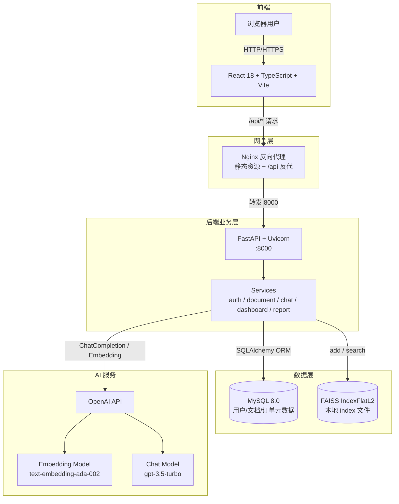
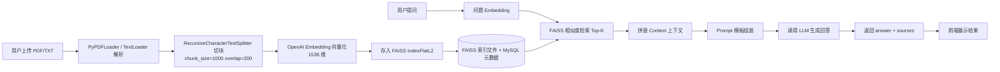
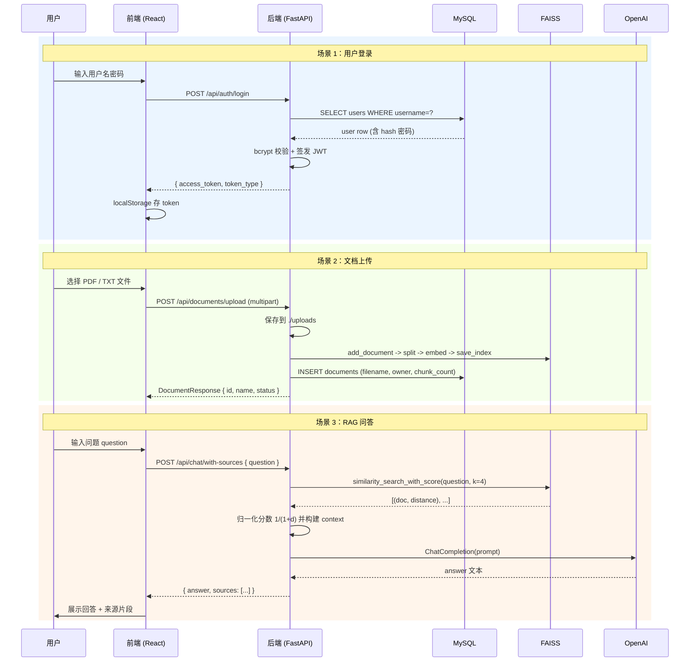
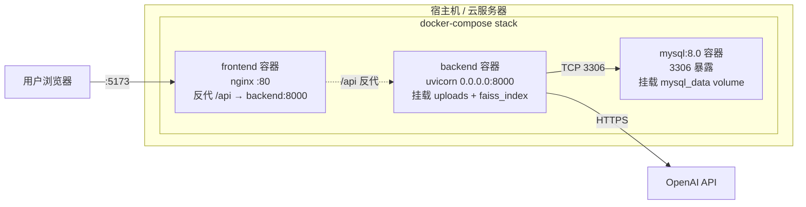

# Enterprise AI Assistant 架构说明

> 本项目是一个面向企业的 AI 知识助手与销售分析平台，覆盖 RAG 问答、文档管理、销售看板与 AI 业务分析四大能力。

## 1. 系统架构图

下图展示了系统的整体分层结构：浏览器 → React 前端 → Nginx 反向代理 → FastAPI 后端 → MySQL/FAISS/OpenAI 数据与 AI 服务。



整体采用经典的前后端分离 + 多层架构：

- **前端层**：浏览器 + React 单页应用，通过 Nginx 统一入口访问。
- **网关层**：Nginx 提供静态资源托管与 `/api` 反向代理，避免前端 CORS。
- **后端业务层**：FastAPI 提供异步 RESTful 接口，内部按 `api / services / schemas / models` 分层。
- **数据层**：MySQL 存储结构化业务数据，FAISS 本地文件存储文档向量。
- **AI 服务层**：通过 OpenAI 兼容协议同时提供 Embedding 与 Chat 能力。

## 2. RAG 流程图

RAG（Retrieval-Augmented Generation，检索增强生成）是本项目的核心 AI 能力。下图描述了从文档入库到问答生成的完整流程。



关键步骤说明：

1. **文档加载**：根据文件类型选择 `PyPDFLoader` 或 `TextLoader`，提取原始文本。
2. **文本切分**：使用 LangChain 的 `RecursiveCharacterTextSplitter`，按 `["\n\n", "\n", " ", ""]` 递归切分，保留语义完整。
3. **向量化**：调用 OpenAI `text-embedding-ada-002`，输出 1536 维向量。
4. **索引存储**：写入 `FAISS.IndexFlatL2`，同时将文档元数据持久化到 MySQL。
5. **检索**：用户问题同样向量化后，在 FAISS 中按 L2 距离检索 Top-K 文档。
6. **Prompt 拼装**：将 Top-K 文档拼接为 `context`，与 `question` 一起注入 Prompt 模板。
7. **生成回答**：调用 Chat Model 输出答案，并附带 `sources` 引用返回前端。

## 3. 数据流图

下面通过 `sequenceDiagram` 展示三类核心场景的端到端数据流：用户登录、文档上传、RAG 问答。



时序图中清晰呈现了：

- **登录**走的是纯 DB 路径，不涉及 AI 服务，登录态通过 JWT 维持。
- **上传文档**会同时写两份数据：原始文件落磁盘，文档元数据落 MySQL，向量落 FAISS。
- **RAG 问答**是经典的「先检索、后生成」流程：先 FAISS 取 Top-K，再 OpenAI 出答案。

## 4. 目录结构

```
enterprise-ai-assistant/
├── backend/                          # FastAPI 后端
│   ├── app/
│   │   ├── api/                      # 路由层（auth/chat/dashboard/documents/report）
│   │   ├── core/                     # 配置/数据库连接/安全
│   │   ├── models/                   # SQLAlchemy ORM 模型
│   │   ├── schemas/                  # Pydantic 数据模型
│   │   ├── services/                 # 业务逻辑（vector_service / chat_service …）
│   │   ├── utils/                    # 工具方法
│   │   └── main.py                   # FastAPI 入口
│   ├── uploads/                      # 用户上传的原始文件
│   ├── faiss_index/                  # FAISS 索引文件持久化目录
│   ├── init_db.py                    # 启动时建表
│   ├── requirements.txt
│   └── Dockerfile
├── frontend/                         # React 前端
│   ├── src/
│   │   ├── pages/                    # 页面级组件
│   │   ├── components/               # 通用 UI 组件
│   │   ├── services/                 # axios 封装
│   │   ├── hooks/                    # 自定义 Hooks
│   │   ├── types/                    # TS 类型定义
│   │   └── main.tsx
│   ├── index.html
│   ├── nginx.conf                    # 前端容器内 nginx 配置
│   ├── package.json
│   └── Dockerfile
├── docs/                             # 项目文档
│   ├── api.md
│   └── architecture.md
├── docker-compose.yml
├── .env.example
└── README.md
```

## 5. 核心模块说明

### 5.1 后端：FastAPI 路由分层

后端采用经典的四层架构，职责清晰、低耦合：

- **`api/` 路由层**：定义 HTTP 端点，参数依赖注入（`Depends`），返回 Pydantic 模型。
- **`services/` 业务层**：封装跨模型/跨组件的业务规则，例如 `vector_service` 负责 FAISS 增删查，`chat_service` 负责 RAG 流程编排。
- **`schemas/` 校验层**：Pydantic v2 模型，对入参出参做严格校验，FastAPI 自动生成 OpenAPI。
- **`models/` 持久层**：SQLAlchemy 2.0 ORM 模型，对应 MySQL 表结构。

请求在四层之间的流转：`api → service → model → DB`，保证业务逻辑不会被 HTTP 框架侵入。

### 5.2 向量层：FAISS IndexFlatL2 + LangChain 封装

- **底层索引**：使用 `faiss.IndexFlatL2`（精确 L2 距离、暴力搜索），实现简单、零配置。
- **封装层**：通过 LangChain 的 `FAISS` 包装类，将向量与 `Document`（含 `page_content` 和 `metadata`）绑定。
- **持久化**：`save_local` / `load_local` 写入/读取 `faiss_index/` 目录下的 `.index` 与 `.pkl` 文件。
- **检索接口**：`similarity_search_with_score` 同时返回文档和距离，业务层再做相似度归一化。

### 5.3 LLM 层：ChatOpenAI + PromptTemplate

- **统一接口**：使用 `langchain_openai.ChatOpenAI`，可一行切换 OpenAI / 兼容协议服务（如 Azure、自建 vLLM）。
- **Prompt 模板**：使用 `ChatPromptTemplate` 集中管理 prompt，便于 A/B 实验与版本控制。
- **职责单一**：LLM 调用被收敛在 `chat_service` 和 `report_service` 中，业务层只关心"问什么、拿到什么"。

### 5.4 前端：React + TypeScript + Recharts

- **页面级路由**：`react-router-dom` 管理 `/login`、`/chat`、`/documents`、`/dashboard`、`/report` 等页面。
- **状态管理**：优先使用 `useState` / `useReducer` + Context，避免引入 Redux 等重武器。
- **可视化**：`recharts` 绘制销售趋势、品类占比等图表，组件化声明式 API 与 React 心智模型一致。
- **样式**：`tailwindcss` 原子化 CSS，配合 `lucide-react` 图标，UI 简洁统一。

## 6. 部署架构

下图描述了生产环境使用 Docker Compose 部署时的容器拓扑：



部署关键点：

- **mysql 容器**：使用 `mysql:8.0` 官方镜像，开启 `utf8mb4` 字符集与 `mysql_native_password` 鉴权，挂载 `mysql_data` 命名卷实现数据持久化；通过 `healthcheck` 暴露健康状态。
- **backend 容器**：`depends_on: condition: service_healthy` 等待 MySQL 就绪；启动顺序为 `init_db.py`（建表 + 种子数据） → `uvicorn app.main:app --host 0.0.0.0 --port 8000`；`uploads` 与 `faiss_index` 挂载为命名卷，避免容器重建丢失文件。
- **frontend 容器**：多阶段构建 —— Node 阶段构建 React 产物，Nginx 阶段仅托管 `dist/`，最终镜像体积小；`nginx.conf` 配置 `/api` 反代到 `backend:8000`，避免前端 CORS 跨域。
- **环境变量**：通过根目录 `.env` 注入 `OPENAI_API_KEY`、`SECRET_KEY` 等敏感配置，容器内不硬编码。
- **可扩展性**：后端为无状态服务，未来可水平扩容多个实例；向量层当前使用本地文件，后续可平滑迁移到 Milvus / Pinecone 而不改业务代码。
